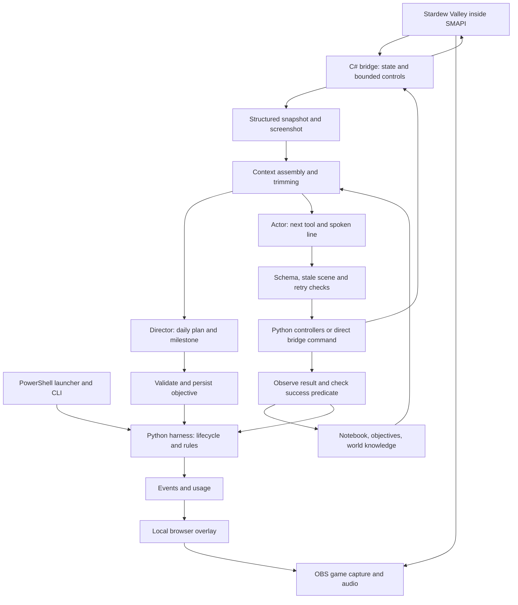

# Autoplay: implementation review

Source snapshot: `c6e094c`, 3 September 2026. Farmer autonomy, overlay operator commands, checkpoint/resume, history search, entrance-aware routing and new-work validation are implemented. See [current readiness](E:/Claude/autoplay/docs/readiness-2026-09-03.md) and [operator controls](E:/Claude/autoplay/docs/operator-controls.md). Model calls were disabled in the targeted live checks.

**Current assessment:** the harness and local broadcast setup are prepared for a supervised rehearsal. South-entrance return/save, checkpoint reload, dialogue selection, and short OBS audio/video checks passed. Channel connections, upload verification, and one clean 30-minute autonomous recording remain before public streaming.

For exact runtime instructions and function schemas, open the companion [prompt and tool explorer](E:/Claude/autoplay/docs/harness-reference-2026-09-03.html) or [JSON export](E:/Claude/autoplay/docs/harness-reference-2026-09-03.json). These contain the application prompts from this repository, not the instructions of the Codex development session.

## 1. The whole system

Latest additions: the audience feed now keeps only previous/latest actions and public explanations beside a scaled,
uncropped game frame. It refreshes on completed decisions and tool outcomes; it does not stream private reasoning.
Shared farmer instructions explicitly cover earning income, retaining useful reserves, replenishing supplies, and
choosing useful crafts/upgrades. The director reviews needs against cash and inventory and requires observed
economic milestones. Existing visual/menu controls handle these activities; end-to-end economic behavior remains
unproven. See [overlay details](E:/Claude/autoplay/docs/overlay.md).



There are two model roles, using the same configured model. They are fresh requests with different instructions and tools. They are not persistent conversational agents, and they do not talk directly to each other. Python carries their plans and observations between requests.

The director decides what the farmer is trying to accomplish. The actor chooses the next action. Python decides whether that action is allowed and whether an objective is complete. The C# bridge reads game state and executes ordinary control effects inside the game.

The model does not receive shell access, arbitrary Python, save-editing commands, the Codex tool catalog, or the second-brain vault. Its entire action surface is the function schema selected for that request.

## 2. What is actually current

| Area | Current state |
| --- | --- |
| Runtime revision | `c6e094c` lean feed/livelihood; `ad203b1` route/work/dialogue/retried-save fixes; `b3bf9f7` OBS and durable narration; earlier operator runtime `45526a3` |
| Processes | Game, recorder, overlay and owned helpers stopped after the earlier checks |
| Last verified game save | Spring 21, 06:00; south-entrance return/save and checkpoint reload verified; cat Dudley adopted during manual setup |
| Persistent harness notebook | Days 17 and 18; 16 lessons, 6 learned facts, 0 weekly summaries, **0 interaction memories** |
| Objective ledger | No active objective; 59 historical objectives, 74 progress entries, 1 opportunity |
| World memory | Last observation FarmHouse, day 21; 8 visited names; entrance-scoped daily blocks expired after saving |
| Tests | 205 passing offline Python tests; targeted route/save/reload/dialogue checks made zero model calls |
| Live validation | Four rehearsal attempts; none passed the 30-minute gate |

The game and harness remain separate persistence systems. Their current paired checkpoint is `6394d027d2db4de480309f852d5668c6`. The notebook retains its earlier days; next-session planning starts a new day from the observed date. If no objective was interrupted, normal planning chooses the next goal. Retried save requests retain the original interrupted intent without nesting save-only goals.

The experience system is implemented but has not yet accumulated real autonomous memories. An empty journal does not mean the farmer has already formed likes and dislikes.

## 3. Startup and one decision cycle

The PowerShell launcher finds Python and supplies `OPENROUTER_API_KEY` from the environment or the local `.env`. The key is used by the HTTP client; it is not included in model context. Python creates a UUID run directory and opens persistent state unless `--isolated-state` is selected.

Startup connects to an existing named pipe or launches SMAPI. It requests a borderless window, waits for rendering, and uses fixed normal menu clicks to load the first save. This bootstrap does not use a model. The current title recovery assumes the established 1080p layout and first save row; it is not a general save-selection interface.

A normal cycle:

1. Observe structured state and capture a fresh game-window image.
2. Start a new-day plan or refill the agenda when needed.
3. Apply or discard a completed background director review.
4. If no objective exists, ask the director synchronously for one.
5. Check whether the active success condition is already true.
6. Choose state-only or visual actor mode. Build context and make one model request.
7. Validate the returned function arguments. Re-observe before game input.
8. Reject a stale scene or unchanged repeated action; otherwise execute the selected tool.
9. Log results, update lessons and retry counters, and complete any now-true objective.
10. Repeat until a cap, stop condition, or error ends the run.

**The world clock and animations run during thinking.** There is no harness write to `Game1.paused`. Native game menus can pause normally. After a run with `--keep-game-open`, cleanup may open the normal Escape menu for handoff; this is separate from active gameplay.

The Python main thread waits during an actor request. The farmer therefore often stands still while the world continues moving. A multi-step controller can keep the farmer busy for a longer stretch, but there is no background ambient-action planner filling every inference gap.

## 4. Actor versus director

| Property | State actor | Visual actor | Director |
| --- | --- | --- | --- |
| Purpose | Choose a verified local skill or travel action | Handle detailed controls, menus and uncertain interactions | Plan the day and preserve a coherent objective |
| Image sent | No | Yes | Yes |
| Tools normally sent | 15 | 26 | 6 |
| Can send game input | Through a limited set of controllers | Through controllers and direct controls | No |
| Can choose a new objective | Yes, including interruption | Yes, including interruption | Yes, only when none is active |
| Writes interaction memories | Yes | Yes | No |
| Speaks through `say` | Yes | Yes | No dedicated `say` field |

State and visual are two modes of the same actor. They share the farmer identity, objective and selected memories; they do not communicate through a separate conversation. State mode avoids sending an image and exposes a smaller tool set to reduce request size. Visual mode supplies the image and full ordinary controls for detailed interaction.

State-only mode is selected when the world is loaded, the player is free and can move, no menu/event/minigame is active, and there are no nearby NPCs or dialogue choices. It is not a confidence score or a semantic assessment of the task. Visual details absent from structured state may go unnoticed in state mode.

`inspect_scene` asks for a visual decision on the following cycle. It costs a model decision itself. Python chooses the mode again afterward. The harness still captures screenshots during ordinary observation even when the image is omitted from the model request. A usual action uses one actor call, not three calls through state, visual and director. A state-to-visual inspection uses two actor calls; director calls occur separately for planning/reviews, and transport/validation retries can add physical API attempts.

Routine director reviews start after 12 counted game controls by default. A single background thread performs the model request while the actor continues. The result is accepted only if the snapshot remains compatible and the tool is `continue_objective`. Old reviews, blocking proposals, and other non-routine decisions are discarded. Discarded calls still cost money.

Snapshot compatibility includes operator revision, objective, location, calendar date, menus/events, inventory, crop counts, money, health, and whether stamina is low. Ordinary position and clock movement do not invalidate routine reviews. New objectives, agenda creation, farm planning, and bedtime reflection use synchronous calls. Special planning calls expose only the relevant single tool, not all seven director tools.

Sources: [runner.py](E:/Claude/autoplay/harness/autoplay_harness/runner.py), [state_actor.py](E:/Claude/autoplay/harness/autoplay_harness/state_actor.py).

## 5. Persona and instruction layers

The shared identity begins:

> You are a farmer making a home in Pelican Town. This is your daily life: a patch of land to care for, neighbors to get to know, and a world full of things you have yet to understand.

It asks for curiosity, warmth, a slightly wry voice, and preferences developed through experience. It forbids invented friendships and memories. Surprise encounters may interrupt work immediately, including unplanned trips. The actor can use `change_objective` to adopt a substantial new pursuit; unfinished work stays in history and linked agenda items return to pending. It chooses which opportunities to postpone.

The actual prompt assembly is:

| Role | System instruction composition |
| --- | --- |
| State actor | Shared farmer identity + compact state/controller instructions + narration instruction |
| Visual actor | Shared farmer identity + full world/control reference + objective stability, pointer, safety and narration rules |
| Director | Shared farmer identity + the **same full world/control reference** + planning, variety, success-condition and asynchronous-review rules |

The full reference includes controls, tool selection, crops, pathfinding, door hours, bedtime, resource preservation, screenshots, title recovery and normal game mechanics. These details currently remain in the director prompt even though the director cannot operate those controls.

The actor must choose exactly one tool. Every actor tool requires `say`, a first-person, present-tense line of at most 140 characters. The line should briefly explain what the farmer intends or notices and why now, without tool names, coordinates, or being an AI. This is public narration generated with the action; it is not a transcript of private reasoning. There is no separate narrator model or text-to-speech engine.

The agenda is now a revisable intention. The farmer chooses when to interrupt or resume it and weighs responsibilities, dislikes, health, energy and safe return itself. Preference strength and revision are also autonomous: no forced tentative stage or encounter-count threshold exists. Structured success conditions, honest outcomes and failed-target retry limits still apply. Enjoyment and curiosity influence model choice through text; no numerical curiosity drive or mood system exists.

Sources: [prompts.py](E:/Claude/autoplay/harness/autoplay_harness/prompts.py), [state_actor.py](E:/Claude/autoplay/harness/autoplay_harness/state_actor.py).

## 6. Exactly what reaches the model

Each call has one system message and one user message, plus function schemas. The user message contains a stable text block, a changing JSON block, and an image when applicable. There is no replayed chat transcript and no sequence of native assistant/tool-result messages.

```text
system: role-specific instructions
user:
  stable text:
    objective_ledger
    notebook
    world
  changing JSON:
    role, memory, wiki_results, director_feedback,
    game_state, frame, counters,
    recent_interaction (actor, when present)
  image: current JPEG (visual actor/director only)
tools: schemas for this role/call
```

| Context block | Contents and limits |
| --- | --- |
| Objective ledger | Active goal/condition/milestone; last 3 historical objectives; last 4 progress notes; last 4 opportunities. Audit timestamps removed from model context. |
| Actor notebook | Today's theme and compact agenda, crop-zone rectangles, 3 top lessons, up to 4 interaction memories. |
| Director notebook | Agenda and carried items, farm zones/notes, yesterday's reflection up to 400 characters, 6 lessons, last 8 learned facts, yesterday's category mix, 3 themes, latest week summary up to 300 characters, up to 6 interaction memories. |
| World | Current location, nearby exits, nearest unvisited names, inaccessible/blocked/closed routes, visit counts, route home. This is a summary of a larger map held by Python. |
| Recent memory | Last 12 selected events, reduced to arguments, result status/reason, and selected state fields; rolling accomplishments/failures/learned/unresolved summaries. |
| Wiki / history search | Latest excerpts; subject to early trimming. |
| Operator | Current mode and most recent guidance, bounded to 600 characters. |
| Director feedback | Why a previous proposal was rejected, agenda reminder or stall instruction. |
| Game state | Structured game snapshot, plus last tool result, low-stamina/bedtime flags, stall count and blocked movement directions here. |
| Frame | UUID, original width/height, brightness and variation measures; omitted in state mode. |
| Counters | Actor decisions, counted game controls, bounded caps or continuous-mode indicator. |
| Recent interaction | Evidence about the last attempted input: where/when, tool/status/reason, changed field names, a short dialogue excerpt. |

Notebook retrieval remains automatic and selective. `search_history` additionally retrieves earlier actions and objectives from the audit archive; arbitrary notebook search is not exposed. Shared state is still installation-wide. Checkpoint resume validates save identity, but normal runs are not automatically namespaced per save.

State mode drops detailed geometry and represents inventory, nearby crops, tillable soil and objects as column/row tables. The local executor retains full state and fresh screen coordinates. Visual/director requests receive the fuller snapshot, subject to trimming.

## 7. Context size and caching

The caps are **4,500 estimated tokens of context JSON for actors and 8,000 for directors**, using `JSON characters / 3.5`. They do not include system instructions, tool schemas, images, or API framing. They are not measured provider token limits.

Measured from the current source using the same character estimator:

| Default role request | System characters | Tool-schema characters | Estimated fixed text tokens, before context/image |
| --- | ---: | ---: | ---: |
| State actor, 16 tools | 9,321 | 11,890 | 6,060.3 |
| Visual actor, 27 tools | 15,312 | 19,858 | 10,048.6 |
| Director, 7 tools | 19,023 | 4,106 | 6,608.3 |

These are source-size estimates, not billed counts. The former rehearsal's measured token totals predate the latest persona addition, so they are historical evidence rather than a measurement of today's prompts.

When JSON is too large, the harness cuts in this order:

1. Remove wiki results, then archive-search results.
2. Reduce recent events to the last 6.
3. Keep only 3 lessons.
4. Shorten agenda/carried goal text to 40 characters.
5. Reduce actor nearby-object rows to 12.
6. Reduce nearby crop rows to 24.
7. Remove local navigation rows and diagnostics; actors also lose farm layout, directors retain it.
8. Remove retrieved interaction memories from the end until the packet fits.

The objective ledger and last-result fields remain protected. If allowed cuts are insufficient, the harness raises an error before sending the request. Protected content can still grow too large; the latest director overflow fix has unit coverage but no new autonomous recording.

Stable prefix construction places objective ledger, notebook and world before dynamic data; nested keys are sorted and audit timestamps removed. Luna requests use an explicit cache key hashed from model, system instructions, schemas and stable context, with a requested 30-minute TTL. The stable block carries the cache breakpoint. This is a request for provider caching, not a guarantee of a hit. Changes to notebook/world/objective content can change the prefix and cache key.

Sources: [context assembly](E:/Claude/autoplay/harness/autoplay_harness/runner.py), [HTTP request construction](E:/Claude/autoplay/harness/autoplay_harness/openrouter.py).

## 8. Complete runtime tool inventory

All actor tools require `say`; it is omitted below for readability. **S+V** means state and visual actors; **V** means visual only; **S** means state only. There are 26 visual tools, 15 state tools, and 27 distinct actor tool names across both modes.

| Tool | Modes | Main arguments | Behavior/proof |
| --- | --- | --- | --- |
| `change_objective` | S+V | goal, success_condition, milestone, reason, optional agenda_id | Adopt a new pursuit without director approval; preserve the prior objective as interrupted. |
| `remember_interaction` | S+V | subject, interaction, outcome, preference, note | Save the last attempted interaction and reaction; no game input. |
| `plant_nearest_seeds` | S+V | seed_slot 0–11, count 1–6 | Select nearby empty soil; verify each crop and seed decrement. |
| `plant_seeds` | V | seed_slot 0–11, 1–6 tiles | Same controller, explicit target tiles. |
| `water_crops` | S+V | 1–6 tiles | Verify watered state and water spent; does not refill the can. |
| `till_tiles` | S+V | 1–6 tiles | Verify empty tilled soil appeared. |
| `clear_debris` | S+V | 1–6 targets | Select observed recommended tool; verify obstacle removal. |
| `go_home_and_sleep` | S+V | none | From Farm/FarmHouse: reach bed, answer, verify new day and increased save count. |
| `navigate_to` | S+V | tile_x, tile_y | Walk to one tile in the current location. |
| `go_to_location` | S+V | adjacent location | Reach and pass through one exit. |
| `travel_to` | S+V | destination | Compute route and verify each hop. |
| `world_map` | S+V | destination | Compute a route and compact map summary; no input. See result-delivery limitation below. |
| `control_sequence` | V | 1–6 button/tick steps | Batch keyboard steps; each 1–120 ticks; stop on relevant changes. |
| `press` | V | buttons | One tick of allowed keyboard input. |
| `hold` | V | buttons, ticks 1–600 | Bounded keyboard input. |
| `move_cursor` | V | frame_id, normalized x/y | Move pointer against the referenced frame. |
| `click` | V | frame_id, x/y, left/right | Click the referenced target. |
| `drag` | V | frame_id, start/end x/y, button, ticks 1–120 | Bounded drag. |
| `scroll` | V | direction, steps 1–20 | Wheel input; no frame_id argument. |
| `wait` | V | field, value, timeout_ticks 1–600 | Wait for one of 9 supported state fields. |
| `idle` | V | ticks 1–600 | Intentional waiting without input. |
| `choose_dialogue_response` | V | index 0–20 | Activate the visible game's response component. |
| `objective_progress` | V | note, evidence | Append a progress claim; does not itself complete an objective. |
| `record_opportunity` | S+V | note, reason | Queue an idea the farmer chooses to postpone; does not change the objective. |
| `search_history` | S+V | query, optional kind and limit | Retrieve up to 5 earlier action/objective excerpts. |
| `wiki_search` | S+V | query | Search/read Stardew Wiki; cache exact normalized queries in memory. |
| `stop_session` | S+V | reason | Behavior depends on continuous/forever mode; see below. |
| `inspect_scene` | S | none | Request a visual actor call next cycle. |

Allowed keys: W/A/S/D, LeftShift, X, C, E, Escape, F, M, Y, N, Tab, D0–D9, OemMinus, OemPlus. No free-text typing or arbitrary console command is exposed. Pointer coordinates are normalized 0–1 and converted against the original frame dimensions.

`wait` fields: world_ready, game_active, player_free, can_move, using_tool, event_up, menu, location, minigame.

| Director tool | Inputs | Effect |
| --- | --- | --- |
| `search_history` | query, optional kind and limit | Same bounded archive retrieval. |
| `plan_day` | theme, agenda items, dropped carried items | Daily plan or refill. Items have goal, slot, category, optional success_condition/carried_id. |
| `update_farm_plan` | 1–20 named rectangular zones, notes | Persist crop/tree/path/building/animal/reserve layout. |
| `reflect` | summary, learned facts, 1–3 lessons | Save end-of-day interpretation and lessons. |
| `continue_objective` | milestone, reason | Refine the current objective. |
| `block_objective` | evidence | Block in bounded mode; rejected for an active objective in continuous mode. |
| `set_objective` | goal, success_condition, milestone, optional agenda_id | Create a validated objective when no objective is active. |

Schemas reject additional fields and check types, numeric limits, enums, array bounds, and maximum string lengths. The client implements a subset of JSON Schema itself. Some text fields are unbounded, and minimum string length is not generally checked there; the interaction notebook adds its own nonempty validation.

Sources: [tools.py](E:/Claude/autoplay/harness/autoplay_harness/tools.py), [execution dispatch](E:/Claude/autoplay/harness/autoplay_harness/runner.py).

## 9. What “skills” means here

Runtime skills are handwritten Python controllers: planting, watering, tilling, clearing, travel and bedtime. They decompose one model choice into several bridge controls and verify intermediate effects. They do not invoke a model internally, except normal bedtime requests a reflection before the sleep controller. Operator Finish & Save skips that model request.

A planting controller can walk beside soil, select seeds, face/aim, plant with ordinary input, and verify both a crop and one consumed seed. It stops with partial evidence if it cannot finish. The controller does not accept a successful click as proof of a planted crop.

Continuous-mode control budgets are currently: planting 5 × requested tiles; watering/tilling 8 × tiles; debris 16 × targets; bedtime 45 controls; travel at least 3 controls and otherwise 3 × map-node count. In bounded mode they share the run's remaining action budget. Debris also caps swings at 12 for axe/pickaxe and 2 for scythe. Farm controllers guard against unavailable control, changed location/menu/event, damage and exhausted budgets. Local stamina checks and prompt thresholds are not fully uniform: debris can continue down to its local cutoff of 20, while prompts call below 30 “low.”

There is no dynamic skill discovery, `SKILL.md` loader, generated skill library, training, or automatic code modification in the farmer runtime. Learned text may change which existing tools it chooses; it cannot teach itself a new controller.

The development session's `orient`, `save`, `model-routing`, and other Codex skills are a separate system used while developing this repository. Earlier Terra workers were development delegates, not agents living inside the farmer.

The saved design decision is **skills only for repetitive chores that have proved unreliable**, with model improvisation retained for exploration, dialogue, shops, quests, fishing, mining, combat and relationships. The absence of scripted social/fishing controllers is intentional, not automatically a defect. Raw inputs remain available through visual mode. What remains unproven is reliable improvised performance in those activities; an agenda category does not establish capability. Harvesting and can refilling are examples of chore coverage to evaluate from observed failures.

That prior decision also requested a disk-backed wiki cache. The current wiki implementation still caches only within one process. The persistent notebook exists, but it is not a general read/write notes tool or automatically isolated by save identity.

Sources: [farming.py](E:/Claude/autoplay/harness/autoplay_harness/farming.py), [world.py](E:/Claude/autoplay/harness/autoplay_harness/world.py).

## 10. Objectives, daily plans and completion

Objectives have a human-readable goal, a milestone, and a machine-evaluated success condition. Only one is active. The actor can replace it with `change_objective`, giving a reason and a currently false structured condition. The prior objective is saved as interrupted, not completed or failed; its agenda item becomes pending. The actor can resume an unfinished agenda item by its ID. Short spontaneous interactions require no objective change. The harness checks completion before actor decisions and after results, and records evidence automatically.

Conditions are conjunctions of structured comparisons, separated by commas or `and`. Operators: `is`, `=`, `==`, `!=`, `>`, `>=`, `<`, `<=`. There is no `or`, event-sequence language, temporal logic, or built-in “increase since objective start” operator. Inventory conditions resolve by item name; absent items count as zero.

For example, `inventory.Wood >= 50` proves possession of at least 50 wood, not that 50 were gathered during this objective. The planting incident is now addressed: new model objectives cannot use `plantedCrops`, which includes existing local crops. They use `seedsSown` above its observed cumulative value. Other crop-work clauses must be unfinished now and explicitly name the current observed location. This prevents arrival or another false clause from masquerading as that work. Existing historical or explicitly supplied user predicates are not rewritten; broader intent still depends on a correctly chosen predicate.

New objective proposals are rejected if already true, unsupported by available fields, tied to an invalid agenda item, or equivalent to a target deferred earlier that day. Actor changes also cannot reword the current target to reset its retry accounting. Self-chosen objectives without agenda items retain dated retry-deferral evidence in history, so the actor and director cannot reopen them unchanged that day. A necessary bedtime return can reopen a deferred home target. Actor-chosen new pursuits need no agenda ID; the director still follows the existing agenda-selection validation. Slots are suggestions that the farmer may reorder.

Planning asks for 5–8 morning-plan items across day slots, an evening item, exploration while unvisited places remain, accounted-for carried items, and varied categories. Refills request 2–4 more tasks before bedtime. Categories are farming, clearing, exploring, social, shopping, fishing, mining, foraging, crafting, event, home.

**These planning rules are not all hard invariants.** `_request_agenda` gives two attempts and can then apply the last plan with an `agenda_accepted_with_gaps` event. Basic notebook schema validation remains, but variety/exploration/coverage checks can be accepted with gaps. Some invalid carried IDs are stripped before validation. This deserves review rather than describing the planner as strictly compliant.

Farm zones persist once created. Plant/till controllers reject targets outside a crops zone on the Farm. Other zone purposes mostly guide planning; they are not a universal zoning enforcement system over every generic control.

Sources: [objectives.py](E:/Claude/autoplay/harness/autoplay_harness/objectives.py), [planning](E:/Claude/autoplay/harness/autoplay_harness/runner.py), [director validation](E:/Claude/autoplay/harness/autoplay_harness/runner.py).

## 11. Memory: storage, learning and forgetting

| Store | Durable contents | What survives a new run |
| --- | --- | --- |
| `harness/state/objectives.json` | Active/history, progress, opportunities | All persisted entries; only a small tail is retrieved |
| `harness/state/notebook.json` | Days/agendas/reflections, farm zones, learned facts, lessons, weekly summaries, interactions | All persisted notebook state |
| `harness/state/world.json` | Visits, last location, blocked paths, unavailable edges | Visits and edge failures; blocked paths clear on a new observed day |
| `harness/runs/<id>/events.jsonl` | Detailed observations, calls, outcomes, usage and errors | Audit log; not automatically loaded as the next run's recent memory |
| `session-summary.json` | Run accomplishments/failures/knowledge/opportunities and usage | Audit summary; a new run starts fresh in-memory episode context |
| Wiki cache | Normalized query → page extracts | Process only; lost on restart |

Lessons are either automatic feedback from failures or model-written reflection lessons. There is a cap of 40 lesson records, keyed/deduplicated with repeat counts. Retrieval favors frequent lessons and recency. Once there are at least seven older day entries, weekly roll-up concatenates old reflections, truncates the result to 600 characters, stores category totals and removes those day entries. This is deterministic truncation, not an LLM-written synthesis.

The interaction journal stores location, subject, interaction, possible/unavailable/unknown, liked/disliked/neutral/undecided, note, full date/time, encounter count and compact source evidence. Repeated normalized location+subject+interaction keys update an aggregate, retain the prior report, and increase the encounter count.

The actor can record only after an actual attempted input. Successful recording consumes that pending evidence. The farmer chooses its reaction independently of the factual outcome: an unavailable or uncertain interaction may still be liked or disliked. A failed control cannot be labeled possible; travel alone cannot establish that an interaction is unavailable. No minimum number of experiences or externally chosen confidence threshold governs preferences.

These checks ground the record but do not independently identify the exact object affected. The model supplies the subject and interpretation. `completed` proves the control ran, not the claimed social or emotional effect. A pending interaction is not an immutable screenshot or a full before/after state diff.

Retrieval prefers exact nearby names and the current location, reserves part of the small selection for nearby experiences, and fills with other recent experiences. There are no embeddings, semantic queries, canonical NPC/object IDs, or globally ranked preferences. Synonyms can fragment records; moving to another location can create a separate aggregate. A relevant old experience may remain on disk but miss retrieval.

Interaction records have no total disk-count cap; unique keys can accumulate. They survive weekly roll-up. Under context pressure the retrieved copies can be dropped entirely, without deleting stored memories.

**Calendar correction:** notebook days, world visits/blocked paths, and sleep advancement now use an ordinal derived from year, season and day. Spring year-one keys remain compatible. Tests cover season/year identity; multi-season gameplay itself has not been rehearsed.

Source: [notebook.py](E:/Claude/autoplay/harness/autoplay_harness/notebook.py).

### Long-session context, audit history and restart

**Context growth:** requests do not append every earlier message. Selected history windows and JSON trimming keep model context approximately bounded rather than inherently linear or exponential in session duration. This is not yet a guarantee of indefinite operation: today's agenda and some protected text can grow, and a packet that still exceeds the cap fails before sending. Fixed prompt/tool overhead is additional. The on-disk event archive grows approximately with the number and size of events; it is not injected wholesale into the model.

**Observability:** every returned actor/director decision and tool result is logged, with observations, arguments, timing, errors and returned usage. Controller results include control counts/timings and verified outcomes; this is not necessarily a frame-by-frame or every-key replay. No log can record an API response that never returns. Screenshots require `--save-frames`. Video defaults to rolling retention unless set to zero. Existing run directories have no general automatic retention policy in the harness.

**Agent access:** both actors and the director now expose `search_history`. Queries return at most five 600-character excerpts with source IDs from earlier actions/objectives. A local SQLite index incrementally reads complete event lines and refreshes the objective ledger. Retrieval adds a bounded selection to context, never whole runs. Initial indexing and the indexed text scan still grow with archive size; this is not semantic search.

**Restart:** `--resume-checkpoint` verifies saved-file hashes, backs up current harness state, restores the three matching JSON stores, then verifies loaded save identity/date. It never overwrites the game save and refuses a game changed since the checkpoint. Finish & Save preserves interrupted work. In-memory recent events, pending interaction evidence and wiki cache restart fresh. Ordinary termination without Finish & Save still does not guarantee a save.

### Operator signals: implemented behavior

The operator control contract is implemented in the overlay at `/?operator=1`. The audience view at `/` hides those controls. Commands have queued and received acknowledgements, carry the run ID, and are recorded in the event archive.

| Signal | Implemented effect |
| --- | --- |
| Finish and save | Stop accepting new activities; return home through normal controls; sleep; verify the game's save count/new-day readiness; capture corresponding harness state; stop only after success. If blocked, report it and keep the game open. |
| Steer: free-text guidance | Deliver operator guidance at the next safe action boundary, acknowledge it, and let the farmer adjust its current intention. Preserve unfinished work and record the guidance with the resulting decisions. |
| Hold unsaved | Stop autonomous input at the next safe action boundary; leave the game open in a normal menu. No save is claimed. This is not immediate cancellation. |

Stardew saves overnight. Finish & Save therefore returns home and permits early sleep, suppresses other agendas, verifies the save event and matching disk state, creates a checkpoint, and stops. The active-run STOP file requests this same flow. Steering can help the return route but does not cancel finishing. Commands wait for in-flight requests/controllers; after a save failure or exhausted limit the game stays open and the supervisor does not restart. OBS/Twitch shutdown remains separate.

## 12. Perception, bridge and navigation

The bridge is a .NET 6 SMAPI mod loaded inside Stardew. Python exchanges newline-delimited JSON over `\\.\pipe\autoplay-game-bridge`. A request has UUID, type and typed arguments; the response echoes the ID and returns status/reason/error plus a state snapshot. The pipe server permits one connected client and queues work for game-thread handlers.

The snapshot includes calendar/time/weather, location/tile/pixel/facing, control/menu/night/save state, health/stamina/money, selected tool and inventory, nearby objects/crops/tillable soil/NPCs, dialogue text/responses, shop rows/prices/stock/screen centers, exits/actions, a local collision map and farm layout. It also exposes diagnostics for window focus, animation/control state, pause/fades and bridge errors. Quest/mail counts exist; rich quest content, relationship state and character needs are not modeled as structured systems.

This is privileged structured perception of the game, combined with a screenshot. It is not a pixels-only agent. The model does not infer collision geometry or inventory by OCR alone.

The C# pathfinder uses breadth-first search against game collision checks, up to 8,000 expansions. It moves through ordinary W/A/S/D effects, uses 6-pixel arrival tolerance and a 20-tick navigation stall limit. A requested 600-tick walk can receive an adaptive budget `min(3600, max(600, path_length × 24 + 240))`. Those ticks depend on a progressing game update loop; they are not an independent wall-clock watchdog.

World travel searches location plus incoming-location states. It first uses directed edges, then may try an undirected interpretation. Failed paths are scoped to the incoming location; search can leave Farm through Forest/Town/BusStop and re-enter from the east. Each actual hop is verified, and observed blocked/missing exits trigger another route within the action budget. Entrance identity uses the previous location, not a full tile-component map; multiple entrances from the same source can still share a key. Legacy unscoped blocks remain conservative until expiry.

Temporarily blocked paths clear on a new day; some unavailable edges persist without an automatic expiry/unlock retry. That can matter when progression later opens an initially unavailable route.

Screenshot capture uses DXGI with WinRT fallback, crops the desktop capture to the game client bounds, and resizes to at most 1,280 pixels wide with JPEG quality 75. A 1920×1080 source produces a 1280×720 model image. Frame IDs identify captures; normalized pointer coordinates map back to original dimensions. Observation and capture are sequential, not one atomic game-frame snapshot.

The bridge hides the white native cursor during control and preserves the game's brown pointer. Original settings are restored on bridge stop/error. Live menu checks verified invisible native cursor pixels and working game-pointer clicks. This was menu validation, not a new autonomous farming session.

Sources: [BridgeProtocol.cs](E:/Claude/autoplay/src/Autoplay.GameBridge/BridgeProtocol.cs), [pathfinder](E:/Claude/autoplay/src/Autoplay.GameBridge/ModEntry.cs), [capture.py](E:/Claude/autoplay/harness/autoplay_harness/capture.py).

## 13. Repetition, apparent freezes and recovery

There are several different limits, not one universal retry counter:

| Layer | Current response |
| --- | --- |
| Identical action against unchanged selected state | Reject it. `say` and frame ID cannot disguise the action. |
| Failed movement direction at the same position | Remember and reject that direction there. |
| Continuous active objective | 3 unsuccessful attempts at the same normalized target, or 6 actor decisions without progress → defer for the day and ask for another task. |
| Necessary bedtime home target | At the short retry limit, stop with `home_route_blocked` and preserve the objective. |
| Repeated invalid objective proposals | 3 rejections for the same normalized condition → stop the run. |
| Older stall watchdog | 8 unchanged actor decisions → director review; 16 → focus/display recovery; 24 → stop. Its fingerprint still includes clock movement. |
| Model response validation | Up to 3 response attempts for absent/invalid tool calls. |
| HTTP transport | Up to 3 tries per response attempt for retryable transport/429/5xx failures, within the decision time budget. |
| Recoverable Python loop errors | Recover and retry with backoff; stop after 5 consecutive errors. |

The short objective limiter ignores clock movement; location, tile, inventory/crop/resource/control/menu/dialogue changes can count as progress. Completed intentional wait/idle is exempt. It is not a detector of semantically useful progress: pacing around can change position without advancing the goal. It also excludes stale-scene rejections and does not bound every possible planner loop.

Actor requests are rechecked after inference for changed date/location/menu/control availability, health, event/minigame or dialogue responses. Pointer tools additionally compare player position, viewport and nearby NPCs. This is selective state validation, not image matching; it does not guarantee every moving pixel target is still valid.

The live-clock change removes harness-induced simulation pausing. It does not eliminate inference latency, native menus, long controllers or focus problems. Pipe reads now poll available bytes and impose a 90-second response deadline. Operator commands are still cooperative and are not processed during every sub-step of a local controller.

`stop_session` also differs from its prompt description: bounded mode stops; ordinary continuous mode requests a director review; forever mode accepts only reasons containing “unsafe” or “unrecoverable,” after which the outer supervisor can restart. There is no unified safety-stop protocol across these layers.

Sources: [retry limits](E:/Claude/autoplay/harness/autoplay_harness/runner.py), [watchdog](E:/Claude/autoplay/harness/autoplay_harness/runner.py), [pipe reader](E:/Claude/autoplay/harness/autoplay_harness/bridge.py).

## 14. Model transport, cost and time limits

The configured default is `openai/gpt-5.6-luna` through OpenRouter, reasoning effort `low`, OpenAI-only provider routing, and no provider fallback. Actor and director share the model selection. These are repository configuration values, not a claim about current external availability or pricing.

Other CLI choices are explicitly configured model IDs for MiniMax, GLM, Qwen and two Gemini variants. Each has an allowlisted provider policy; switching models requires a run option. There is no automatic stronger-model escalation or role-specific model routing in gameplay.

The client uses `/api/v1/chat/completions`, maximum output 600 tokens, per-HTTP timeout up to 45 seconds, and a 150-second logical decision budget. Luna requires a tool call and does not set temperature. The client takes the first returned tool call and validates it locally. Invalid-response retries resend the same body; they do not add the validator error to a corrective conversation.

Definitions matter:

- An **actor decision** is one logical tool-selection request, including any internal response retries.
- A **physical attempt** is one HTTP call; several may occur for one decision.
- A **counted game action** is a bridge control counted by the runner/controller, not one model call or one tick. Some observation/settling/bootstrap work is outside this counter.
- A **tick** is one game update. A single tool can consume many ticks and bridge controls.
- A **director review** is another logical model request; it is not included in the actor decision counter.

Usage accounting accumulates returned costs and tokens, including rejected responses and discarded director calls. `--budget-usd` is checked after billed decisions. It is not a hard prepaid ceiling: in-flight/retried calls can exceed it. Error accounting and concurrent reviews further complicate precise cutoff timing. `--max-minutes` is checked between loop stages, so it is also not an immediate interruption of every in-flight operation.

The `--forever` wrapper persists a daily cost ledger, waits until local midnight after budget exhaustion, delays restarts 15 seconds, and adds a 10-minute delay after more than 12 restarts in an hour. STOP prevents startup or requests Finish & Save during an active run. Budget sleep still checks it only after waking. Saved, held and needs-attention operator states terminate supervision instead of restarting.

## 15. Narration, overlay and recording

The local overlay server binds to `127.0.0.1`, default port 8765. Its 1920×1080 page reserves a 384-pixel column for the previous/latest actor action, public explanation, tool and outcome. The OBS game frame is scaled to 1536×864 at x=0, y=108, preserving the full HUD. Duplicate statistics and agenda panels are removed from the audience view. `/?operator=1` adds Finish & Save, guidance, Hold unsaved, command receipts and checkpoint status. POST commands require the local origin and current run ID.

`say` is available only after the action-selection response arrives. The page checks for updates every 500 ms and shows a thinking indicator during requests. It does not stream private reasoning or simulate typing. The general event list holds 8 entries; two actor/operator actions and their outcomes are retained separately so director reviews cannot evict them. A new run clears them. Outcome updates preserve the displayed message instead of replaying its animation.

Provider-returned content/reasoning can be logged, truncated to 2,000 characters, but the audience narration is the explicit `say` field. The overlay is not evidence that a narrated intention succeeded; the action result is separate.

The raw recorder uses FFmpeg Desktop Duplication for display 0 at 30 FPS, with native cursor capture disabled. It tries H.264 NVENC and falls back to software x264. Default segments are 5 minutes; default retention is 6 segments, approximately a 30-minute rolling window. Retention 0 keeps the full run.

The fallback recorder captures the primary desktop, so focus changes could appear in its raw video. It records no audio and does not burn in the overlay. The prepared OBS scene instead captures the game process, its audio, and the audience overlay. Short composition/audio and three-output local tests passed. The clean 30-minute OBS recording remains required; see [broadcast setup](streaming.md).

Sources: [overlay.py](E:/Claude/autoplay/harness/autoplay_harness/overlay.py), [recording.py](E:/Claude/autoplay/harness/autoplay_harness/recording.py).

## 16. Lifecycle and defaults

| CLI option | Default / meaning |
| --- | --- |
| `--resume-checkpoint` | Off; verify and restore the latest matching game/harness checkpoint |
| `--actor-mode` | `state-first`; `visual` forces screenshots to the actor |
| `--max-actions` / `--max-decisions` | 10 counted controls / 15 actor decisions in bounded mode |
| `--continuous` | Removes those run caps; local controller/retry limits remain |
| `--director-interval` | 12 counted game actions |
| `--budget-usd` / `--max-minutes` | Unset; must be supplied for these limits |
| `--forever` | Off; restart wrapper when selected; does not implicitly set `--continuous` |
| `--isolated-state` | Off; run-local harness state when selected; does not reset the game save |
| `--record-video` / `--save-frames` | Off |
| `--keep-game-open` | Off; disabled by CLI in forever mode |
| `--no-launch-game` | Off; automatic launch permitted |

Ordinary cleanup stops recording, stops bridge control/restores cursor settings, releases capture, and terminates the game only if this supervisor launched it. **It does not first guarantee a nightly save.** With `--keep-game-open`, the owned game stays open for handoff and the process waits for it to close. A normal Escape menu may pause it, but the day is still unsaved until sleep succeeds.

Ordinary non-operator failures in `--forever` can still terminate an unsaved day. Finish & Save and Hold explicitly force a handoff when needed; the wrapper respects those terminal operator states.

Other CLI commands: `bridge-test`, `capture-test`, `record-test`, `wiki-test`, `cache-test`, `report`, `overlay`. These have different side effects: some launch/control the game or make provider calls. None was invoked for this review.

## 17. What live evidence proves

Earlier save/reload checks `23d519a3-699b-4317-a1eb-66643c285de5` and `3f1286e8-9646-4409-8865-6e3b09c0a573` verified Spring 20 from FarmHouse. Later run `ccfe4c57-b2fb-43bd-8f95-1abeb15b7529` returned from the south entrance and saved Spring 21; `faf9a20f-1876-44a1-938a-81404fc07e56` verified checkpoint reload and one-call dialogue selection. All used zero model calls/$0. Setup required manual cat-adoption recovery and an earlier route fix; this is targeted evidence, not a clean autonomous rehearsal. [Full evidence](readiness-2026-09-03.md)

The latest recording used an earlier runtime revision than the final dialogue/director fixes, persona, cursor and autonomy changes. It ran 15.3 wall minutes, produced 14:30.40 of raw 1080p30 video and spent $0.228759. Across all four attempts, spend was $0.327020 of the previously authorized $0.60 cap.

| Latest rehearsal measurement | Evidence |
| --- | --- |
| Clock | Spring 18, 06:00 → 23:00; all 368 loaded-world observations reported simulationPaused=false |
| Movement | Six locations visited in that run |
| Model workload | 88 actor and 48 director calls; 140 physical attempts |
| Actor attempt latency | Median 4,038.5 ms; p95 6,558 ms |
| Director attempt latency | Median 4,907 ms; p95 9,255 ms |
| Cache share | Actor 42.3%; director 30.2% |
| Narration | 88/88 actor decisions had a line; late speech loss during director loop |
| Completion | 3 predicates completed, but 0 verified new seed plantings |
| Recovery | Several task deferrals worked; repeated director proposals still caused a 152.2-second no-progress interval |
| Stop | Director context overflow before sending the oversized request |
| Saves | No autonomous nightly save inside the recording; manual cleanup saved Spring 19 afterward |

Unit tests cover the later changes, including experience storage/retrieval, retries, dialogue progress and the failed director packet. They do not establish that the model will choose varied, enjoyable, grounded roleplay for half an hour. Cursor behavior was subsequently checked live in menus. The new farmer persona still needs autonomous observation.

Source: [rehearsal evidence](E:/Claude/autoplay/docs/memory-narration-review.md).

## 18. Findings for your feedback

These are review findings and design choices, not changes made during this review.

| Priority | Finding | Why it matters / possible direction |
| --- | --- | --- |
| Before unattended play | Entrance-aware return-home routing is missing | The observed detour requires distinguishing reachable regions/entrances within Farm; save recovery must operate before the night deadline. |
| Before unattended play | Success predicates can count existing, location-dependent totals as new work | Capture objective baselines and explicit verified events/deltas; distinguish arriving, attempting and completing. |
| Implemented; latency still bounded by action boundaries | Pipe response deadline and operator save/handoff | A 90-second pipe deadline prevents indefinite reads; it does not provide instant cancellation. |
| Implemented; live multi-season gate remains | Full-calendar day identity | Notebook/world keys and sleep verification now cross season/year boundaries; offline tests pass. |
| Persona validation | Autonomous interruption and preference formation are implemented | Observe whether the farmer balances surprises, unfinished responsibilities and personal reactions coherently in live play. |
| Persona design | A remembered experience requires a separate model call | An action-result reflection step could record memory without requiring a full additional action-selection turn. Keep facts and subjective reaction distinct. |
| Persona implementation | Both actor modes now expose `record_opportunity` and `change_objective` | Postponing an interest is optional; a substantial new pursuit does not require director approval. |
| Capability | Planned categories exceed demonstrated reliable performance | Preserve the saved improvisation policy for interesting activities; improve observation/result feedback and evaluate raw-control behavior. Add chore macros only after relevant observed failures. |
| Context | Large shared prompt and all visual tools sent every time | Separate role-specific instructions and select tool families by current scene/task; measure total request tokens, latency and visual fallback rate. |
| Memory | Small exact-name/recent retrieval; no canonical entity identity | Preserve identity across places/names and retrieve relevant old experiences with their conditions and uncertainty. |
| Tool feedback | `world_map` computes a requested route but its details are dropped by prompt-event compaction | Deliver selected result fields explicitly to the next actor request. Current general world summary still appears, but the requested route itself is not preserved there. |
| Contract consistency | Stop behavior still differs from its prompt description | Audit prompt, schema and executor together. State-mode crop-zone references and no-input clock wording were corrected with the autonomy update. |
| Planning enforcement | Invalid plans can be accepted with gaps after two attempts | Choose which rules are hard requirements and which are preferences; do not silently describe both as hard validation. |
| Streaming presentation | Durable speech fixed; short OBS video/audio and three local outputs verified | Connect channels, check upload, and pass the 30-minute rehearsal. See [broadcast setup](streaming.md). |

My suggested review order is: **reliable return/save and truthful progress → the farmer's freedom/obligations/preferences → reliable improvised interactions and necessary chore support → smaller, clearer prompts/context → full recorded rehearsal.** Your feedback on character behavior should shape the capability work, rather than simply increasing the number of planner rules.

## 19. Source map

| File | Responsibility |
| --- | --- |
| [run-harness.ps1](E:/Claude/autoplay/harness/run-harness.ps1) | Python/key setup and launch |
| [__main__.py](E:/Claude/autoplay/harness/autoplay_harness/__main__.py) | CLI defaults and command wiring |
| [runner.py](E:/Claude/autoplay/harness/autoplay_harness/runner.py) | Main loop, planning, execution, retries, context and lifecycle |
| [prompts.py](E:/Claude/autoplay/harness/autoplay_harness/prompts.py) | Shared identity, full control brief, visual actor/director instructions |
| [state_actor.py](E:/Claude/autoplay/harness/autoplay_harness/state_actor.py) | State prompt, subset tools, compact perception |
| [tools.py](E:/Claude/autoplay/harness/autoplay_harness/tools.py) | Function contracts |
| [openrouter.py](E:/Claude/autoplay/harness/autoplay_harness/openrouter.py) | API payload, provider policy, caching, retries and schema checks |
| [objectives.py](E:/Claude/autoplay/harness/autoplay_harness/objectives.py) | Objective ledger and predicate evaluator |
| [notebook.py](E:/Claude/autoplay/harness/autoplay_harness/notebook.py) | Days, zones, lessons, roll-ups, experience memories and retrieval |
| [farming.py](E:/Claude/autoplay/harness/autoplay_harness/farming.py) | Verified local controllers |
| [world.py](E:/Claude/autoplay/harness/autoplay_harness/world.py) | World graph, visits, route memory, multi-hop travel |
| [bridge.py](E:/Claude/autoplay/harness/autoplay_harness/bridge.py) | Python named-pipe transport |
| [ModEntry.cs](E:/Claude/autoplay/src/Autoplay.GameBridge/ModEntry.cs) | Game-thread controls, collision navigation, snapshots and cursor |
| [BridgeProtocol.cs](E:/Claude/autoplay/src/Autoplay.GameBridge/BridgeProtocol.cs) | Wire schema, snapshot types and pipe server |
| [capture.py](E:/Claude/autoplay/harness/autoplay_harness/capture.py) | Window focus and screenshot capture |
| [supervisor.py](E:/Claude/autoplay/harness/autoplay_harness/supervisor.py) | Owned game lifecycle |
| [forever.py](E:/Claude/autoplay/harness/autoplay_harness/forever.py) | Restart wrapper and daily cost ledger |
| [wiki.py](E:/Claude/autoplay/harness/autoplay_harness/wiki.py) | Wiki search, excerpt extraction and process cache |
| [telemetry.py](E:/Claude/autoplay/harness/autoplay_harness/telemetry.py) | Event log, compact recent memory and usage |
| [report.py](E:/Claude/autoplay/harness/autoplay_harness/report.py) | Offline latency, cost, cache and outcome reporting |
| [overlay.py](E:/Claude/autoplay/harness/autoplay_harness/overlay.py) / [page](E:/Claude/autoplay/harness/autoplay_harness/overlay/index.html) | Local feed and audience display |
| [recording.py](E:/Claude/autoplay/harness/autoplay_harness/recording.py) | Raw desktop video segments |

Older docs/specs are useful history, but some tool counts, defaults and validation totals predate the current code. Use this source-pinned review and exported schemas for this feedback pass.
